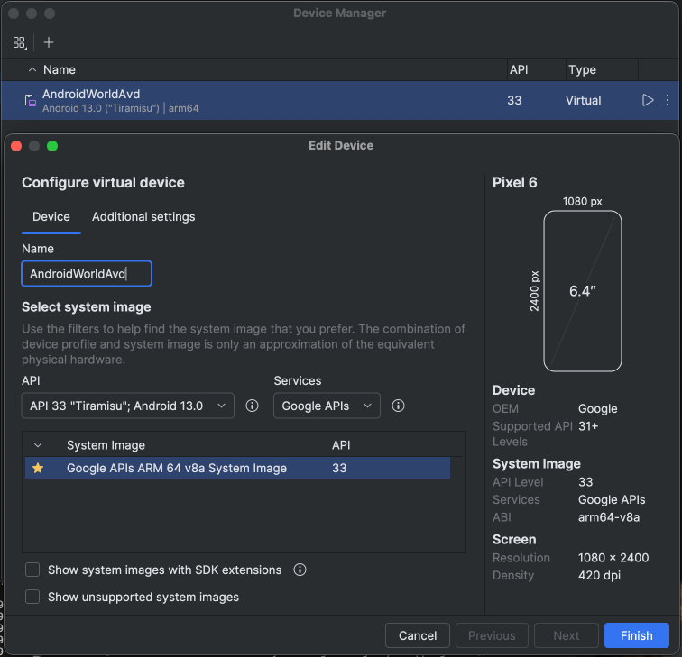
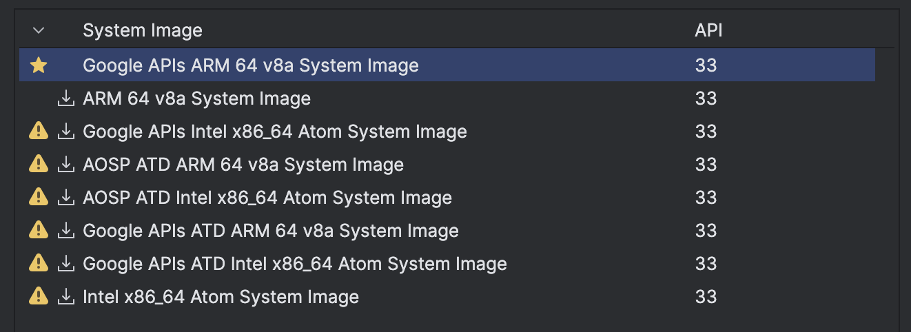

<link rel="stylesheet" type='text/css' href="https://cdn.jsdelivr.net/gh/devicons/devicon@latest/devicon.min.css" />
<h1>
  &nbsp; Technical Interview Task - Farzan Mirza
</h1>

This document serves as my official submission for the [technical interview at gbox](https://docs.google.com/document/d/11XDcIPJqPaJczxd3bZJu001tGlhBJ2QyQOJ7gYeE5YM/edit?tab=t.0#heading=h.yf5q1o75t9l3), showcasing proofs of task completion.  It further explains the reasons for any modifications to official instructions due to the architectural constraints of adapting the *[AndroidWorld Benchmark](https://github.com/google-research/android_world)* for Apple Silicon (M1 Max) to Gbox Agents.

**⛔️ IMPORTANT NOTE:** Section "2. Learnings from Problems" is particularly important, as it details the complex problem-solving and justifications for the unconventional choices made during this challenging but rewarding task.

<br><br>
# Deliverables ✅
## ``Challenge 1`` - Setup AndroidWorld Benchmark ✅ 
- [Image below](appendix/ch1_img_avd.png) demonstrates the AVD configured with exact specifications from the [AndroidWorld README](https://github.com/google-research/android_world/blob/main/README.md). The Device Manager confirms creation of "AndroidWorldAvd" while the Edit Device dialog verifies all required specifications were implemented.


- To verify complete environment setup and agent functionality, two benchmark tasks were executed in sequence:
    - `python minimal_task_runner.py --task=ContactsAddContact`
    - `python minimal_task_runner.py --task=RecipeAddMultipleRecipes`

    The [terminal output](appendix/ch1_term_recipe.txt) has been truncated for readability (reducing repeated `I0`, `W0`, `E0` log entries to max 3 occurrences consecutively) while preserving the exact completion state. The ending output is as described in the [GBOX Technical Interview Task](https://docs.google.com/document/d/11XDcIPJqPaJczxd3bZJu001tGlhBJ2QyQOJ7gYeE5YM/edit?tab=t.0#heading=h.yf5q1o75t9l3) document:
💚
    ```console
    Task Failed ❌; Add the following recipes into the Broccoli app:
    Recipe: Chicken Caesar Salad Wrap
    description: A delicious and healthy choice for any time of the day.
    servings: 3-4 servings
    preparationTime: 1 hrs
    ingredients: to your liking
    directions: Toss chopped romaine lettuce with Caesar dressing, grilled chicken strips, and Parmesan cheese. Wrap in a large tortilla. Try adding a pinch of your favorite spices for extra flavor.

    Recipe: BBQ Chicken Quesadillas
    description: An ideal recipe for experimenting with different flavors and ingredients.
    servings: 3-4 servings
    preparationTime: 3 hrs
    ingredients: subject to change
    directions: Mix shredded cooked chicken with BBQ sauce. Place on tortillas with cheese, fold and cook until crispy. Feel free to substitute with ingredients you have on hand.

    Recipe: Turkey and Cheese Panini
    description: An ideal recipe for experimenting with different flavors and ingredients.
    servings: 6 servings
    preparationTime: 45 mins
    ingredients: flexible ingredients
    directions: Layer turkey and cheese on bread, grill in a panini press until golden. Garnish with fresh herbs for a more vibrant taste.
    ```
    [The 52-second video](appendix/ch1_vid_recipe.mp4) captures the agent's real-time interaction at 4x speed, documenting behavior from step 12 onward of the RecipeAddMultipleRecipes task. Due to file size, please download for optimal viewing.

## 1.2. ``Challenge 2`` - Build Custom Agent to Run Benchmark ✅
- [Terminal output](appendix/ch2_term_avd.txt) shows virtual device from *Challenge 1* until [first screen](appendix/ch2_img_avd.png), setup using the following command:
    ```bash
    ~/Library/Android/sdk/emulator/emulator -avd AndroidWorldAvd -no-snapshot -grpc 8554
    ```


- Then the device is registered using the following GBOX CLI steps
    ```bash
    farzanmirza@Farzans-MacBook-Pro ~ % conda activate android_world
    (android_world) farzanmirza@Farzans-MacBook-Pro ~ % gbox device-connect --device emulator-5554-usb --background
    Establishing remote connection for sdk_gphone64_arm64 (usb, Google)...
    Connection established successfully!
    (Running in background. Use 'gbox device-connect unregister' to stop.)
    ```
- The custom agent [``agents/farzan_agent.py``](../android_world/agents/farzan_agent.py) in action [video](appendix/)


## 1.3. ``Challenge 3`` - Configure Claude Code (cc) to Run Benchmark ✅

```bash

    More stuff will be put in later

```

# 2. Issues and Technical Deep Dive ⛔️  
## 2.1. AndroidStudio Setup
The initial setup process in AndroidFramework's [README.md](https://github.com/google-research/android_world) doesn't account for users with M-Series Macs, such as myself with``ARM-64-v8a M1 Max Macbook Pro``. This caused a lot issues in getting started

### 2.1.1. Outdated System Images

The instructions stated a very specific System Image configuration for the ``Android Virtual Device(AVD)``, which was required for all 3 tasks: Hardware = Pixel 6, System Image = Tiramisu API Level 33, AVD Name = AndroidWorldAvd. 

Problem was that the most recent stable version ``Baklava API 36.0`` is used to setup by default for new users. This meant that I not only had to experiment with mostly unsupported images initially (seen below):

  

Due to its absence from the above AVD System Images liste, I had no idea that a "``Google APIs ARM 64 v81``" image existed for my setup, . So, I endlessly exprimented with remaining images hoping something might work.
- I tried running the agent with ``AOSP: Android Open Source Provider`` versions but since that had access to no Google APIs, I was stuck on running tasks like AddContact where at best the model would hallucinate the correct steps.
- Tried ``x86_64 Intel`` image with the normal ``Docker`` method. This took 30-40 mins to build and simply timed out when trying to run
    ```console
    docker build -t android_world:latest .
    ```
Until I  didnt better understand the SDK options inside, AndroidStudio slighly better: 

> AndroidStudio --> Settings --> Languages & Frameworks --> Android SDK --> SDK Platforms/Tools

I didn't even know there exists a packages, specifically for the ``Google APIs ARM 64 v8A`` image on Silicon macs.
I attempted another install with ``dockerx``,  this time specifically following the orignal README's section for Apple Silicon users. And I tried building/running with a plethora of combinations like
```console
docker buildx build --platform linux/amd64 -t android-emulator:latest
docker run --privileged -p 5555:5000 -it android-emulator:latest
docker run --privileged -p 8554:8554 -p 19925:19925 -it android-emulator:latest
docker run --privileged -e HW_ACCEL_OVERRIDE="-accel on" -p 8554:8554 -p 19925:19925 -it android-emulator:latest
docker run --privileged -p 5001:5000 -it android-emulator:latest
```

Yet each time the result was the same which surprised me that this was listed for Apple Silicon users there. From the truncated outputs below it is also visible the recommended commands were not tested on Macs themselves as we could see the Linux KVM message:


```console
farzanmirza@Farzans-MacBook-Pro android_world % docker logs cca14b73d7fb
* daemon not running; starting now at tcp:5037
* daemon started successfully
linux-gnu: emulator @Pixel_6_API_33 -no-window -no-snapshot -no-boot-anim -memory 2048 Warning: no accelerator found. This Docker image is experimental and has only been tested on linux devices with KVM enabled.
-accel off -grpc 8554 -gpu off
nohup: appending output to 'nohup.out'
==> Checking emulator booting up status 🧐
```
This made me want to start a ``Google Compute Engine`` instance to move everything there until I remembered gbox doesn't work on non-Mac platforms. Thankfully a fresh reinstall with specifically `33-ext-5` version of Tiramisu API Level 33 worked as system image, enough to run the ``minimal_task_runner.py`` file. So a full 24 hours were errantly wasted here. 

### 2.1.2. Connect AVD with GBOX-CLI then register Device
The AndroidWorld README.md very clearly stated to run the AVD from CLI using
```bash
~/Library/Android/sdk/emulator/emulator -avd AndroidWorldAvd -no-snapshot -grpc 8554
```
The AVD was setup with the correct image and ran anytime the above command was run by me. I already had GBOX-CLI installed to play around with the platform a bit. Quite simply all I had to do was follow steps 2 and 3 from the original tech interview document to connect the two and simply run 2/4 more commands from this list, that I already ran the setup commands for:
```bash
brew install gbox
brew update && brew upgrade gbox
gbox login
gbox device-connect
``` 
This is where another day just went debugging something I should have just let go. I ran the login command and sure enough it triggered the OAuth from Github that I did promptly. Strangely a second API key had shown up on my gbox.ai portal but I didnt think much of it. Now the problems started.

To really quickly summarize the issue, initially ``gbox device-connect`` found no devices active, even if the AVD was running, I must have triggered the ``gbox login`` 6 times in this ill-informed state. So through extensive iterating it was finally realized that there is some proxy server which I have to trigger to make the emulator device listed on the ``adb devices`` command. So I edited my shell files to permanently have this:
```bash
pgrep -f gbox-device-proxy > /dev/null || nohup ~/.gbox/device-proxy/gbox-device-proxy --on-demand > /dev/null 2>&1 &
``` 
And just like that my device started showing up on ``adb devices`` command and we connected through these:
```bash
gbox device-connect
gbox device-connect ls   
```
The device said registed locally and worked the same but never showed up on my 'GBOX-->Devices' webpage. No matter how many times we tried it, it would always say device is connected then never show on the gbox platform. 

In order to "get this right" as per challenge 2 Task 2, I spent so much time on this. Specifically cause the instructions confused me. They said

```You will need to register the virtual device you created in Challenge-1 to GBOX https://docs.gbox.ai/cli/register-local-device so that GBOX SDK can use the device.```

Since the device was simply not showing up on the GBOX Web UI, I thought I was doomed. Because instructions specifically point to the agent setup before current challenge so I thought success is measured by first making it appear on the web/ . Moreover when running the benchmark run.py method this device failed for some reason.

To my very limited understanding it seems like there is a mismatch in GBOX-CLI and ARM64-v8a Architectures because it kept trying to connect with my AVD. There was some issue with the --adb or gRPC communication because I had to manually set my ``-adb-path`` when testing agents. This was done by changes in code initially but now I just pass --adp-path in the flag itself when testing a run, even though its the only other default in the run.py file besides the other one. It is also set in my shell profiles as export path yet wont get enforced unless I pass the flag.

Coming back to the weird part, I was so stuck on "virtual" I didnt realize that the SDK can still be accessed. So somehow to the SDK my AVD is registered cause I see the boxes created with its ID just not the device itself.
The sudden switch from virtual to physical device registration in the task further confused me as to what exactly is the virtual device? 

So I now run these steps in this exact order and weird stuff still happens:

```console
# This takes 1 terminal window constantly running AVD locally
~/Library/Android/sdk/emulator/emulator -avd AndroidWorldAvd -no-snapshot -grpc 8554 
 
# The adb path is also setup exported in the background
export PATH="/Users/farzanmirza/Library/Android/sdk/platform-tools:$PATH"

# In the background my .zshrc shell is automatically running the proxy server by this command
pgrep -f gbox-device-proxy > /dev/null || nohup ~/.gbox/device-proxy/gbox-device-proxy --on-demand > /dev/null 2>&1 &

# So a new Terminal shell is opened which then connects the device 
gbox device-connect ls
```
Depending on whether now I have setup my registered device as "physical" or "virtual" the device still doesnt show up on the platform but the boxes it creates do. 

Running the AVD constantly is heavy on computer performance therefore I began running a tweaked version with no window as I was developing the agent:
```bash
~/Library/Android/sdk/emulator/emulator -avd AndroidWorldAvd -no-snapshot -grpc 8554 --no-window
```
But when checking today I realized that when I ran that it failed the main ``run.py`` due to being in headless mode and the devices with "Pending" on my gbox web always confused me but today when I removed the ``--no-window`` and changed the device created by gbox agents to 'physical' it ran the entire benchmark smoothly on my local VM

I feel like such nuances really threw me off trying to figure out why it happens in such a massive codebase. I still don't understand why my device doesnt show up in the Web IDE as registered.
